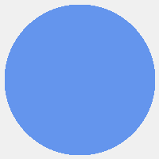

<p align="center">
  
</p>
<h1 align="center">Oh-Ben-Claw 🦀🧠</h1>
<p align="center">
  <strong>Advanced. Distributed. Multi-Device. 100% Rust.</strong><br>
  ⚡️ <strong>One brain, many arms — orchestrate a fleet of AI-powered devices from a single agent.</strong>
</p>
<p align="center">
  <a href="LICENSE"></a>
  <a href="https://github.com/thewriterben/Oh-Ben-Claw/actions"></a>
</p>

**Oh-Ben-Claw** is an advanced, distributed AI assistant built on the [ZeroClaw](https://github.com/zeroclaw-labs/zeroclaw) architecture. It extends the core framework with a multi-device coordination layer, enabling a single intelligent agent to orchestrate a fleet of specialized hardware peripherals — cameras, microphones, sensors, actuators, and more — over a unified MQTT communication spine.

> **Mental model:** Oh-Ben-Claw is the brain. Your ESP32s, NanoPis, and Raspberry Pis are the arms, eyes, and ears.

---

## Architecture Overview

Oh-Ben-Claw is organized around three layers:

| Layer | Component | Description |
|---|---|---|
| **Brain** | Core Agent | The central LLM-powered reasoning engine, running on a host machine. Orchestrates all peripheral nodes. |
| **Spine** | MQTT Broker | The unified communication backbone. All devices publish their capabilities and receive commands over MQTT topics. |
| **Appendages** | Peripheral Nodes | Specialized firmware running on ESP32-S3, NanoPi Neo3, Raspberry Pi, and other hardware. Each node exposes its capabilities as tools. |

```
┌──────────────────────────────────────────────────────────────────────────────┐
│  Oh-Ben-Claw Core Agent (Host: macOS / Linux / Windows)                      │
│                                                                              │
│  ┌─────────────┐   ┌──────────────┐   ┌──────────────────────────────────┐  │
│  │  Channels   │──►│  Agent Loop  │──►│  Unified Tool Registry           │  │
│  │  Telegram   │   │  (LLM calls) │   │  (local + all peripheral tools)  │  │
│  │  Discord    │   └──────┬───────┘   └──────────────────────────────────┘  │
│  │  CLI / GUI  │          │                                                  │
│  └─────────────┘          ▼                                                  │
│                   ┌───────────────┐                                          │
│                   │  MQTT Spine   │  ◄── Unified communication backbone      │
│                   └──────┬────────┘                                          │
└──────────────────────────┼───────────────────────────────────────────────────┘
                           │
         ┌─────────────────┼─────────────────┐
         │                 │                 │
         ▼                 ▼                 ▼
┌─────────────────┐ ┌─────────────┐ ┌─────────────────┐
│ ESP32-S3 Node   │ │ NanoPi Neo3 │ │ Raspberry Pi    │
│ - camera_capture│ │ - gpio_read │ │ - gpio_read     │
│ - audio_sample  │ │ - gpio_write│ │ - gpio_write    │
│ - sensor_read   │ │ - i2c_scan  │ │ - camera_capture│
│ - gpio_read/wrt │ └─────────────┘ │ - audio_sample  │
└─────────────────┘                 └─────────────────┘
```

---

## Key Features

**Multi-Device Orchestration** allows a single agent to command a fleet of hardware nodes simultaneously. Each node registers its capabilities dynamically over the MQTT spine, and the central agent merges all available tools into a single, unified registry. The agent can then use natural language to invoke any tool on any device.

**MQTT Communication Spine** replaces the direct serial-only connections of the base ZeroClaw with a scalable, network-based publish-subscribe model. This enables devices to be located anywhere on the local network (or even the internet via a tunnel), and allows for easy addition and removal of nodes without restarting the core agent.

**Multi-Modal I/O** provides a unified interface for interacting with the physical world. The agent can see (via cameras on ESP32-S3 or Raspberry Pi), hear (via I2S microphones), sense (via I2C/SPI sensors like BME280, MPU6050), and act (via GPIO on NanoPi Neo3 or Raspberry Pi).

**Rich Communication Channels** supports all channels from the base ZeroClaw framework, including Telegram, Discord, Slack, WhatsApp, iMessage, IRC, Matrix, and a built-in CLI. A native GUI application is also planned.

**Pluggable LLM Providers** supports all major LLM providers, including OpenAI, Anthropic, Google Gemini, Ollama (local), and any OpenAI-compatible endpoint.

---

## Supported Hardware

| Device | Transport | Capabilities |
|---|---|---|
| Waveshare ESP32-S3 Touch LCD 2.1 | Serial / MQTT | GPIO, Camera (OV2640), Microphone (I2S), Sensors (I2C) |
| ESP32-S3 (generic) | Serial / MQTT | GPIO, Camera, Microphone, Sensors |
| ESP32-C3 | Serial / MQTT | GPIO, I2C, SPI, Wi-Fi, BLE |
| NanoPi Neo3 | Native (sysfs) / MQTT | GPIO (sysfs), I2C, SPI |
| Raspberry Pi (all models) | Native (rppal) / MQTT | GPIO, Camera (libcamera), Microphone |
| STM32 Nucleo-F401RE | Serial (probe-rs) | GPIO, ADC, Flash, Memory Map |
| STM32H7 Discovery | Probe (probe-rs) | GPIO, ADC, DAC, I2C, SPI, Flash |
| Arduino Uno / Mega | Serial | GPIO, Analog Read |
| Arduino Nano 33 BLE | Serial | GPIO, Analog Read, I2C, SPI, BLE, Sensors |
| Teensy 4.1 | Serial | GPIO, ADC, DAC, I2C, SPI, PWM, CAN |
| nRF52840 DK | Serial | GPIO, I2C, SPI, BLE, PWM |
| BeagleBone Black | Native | GPIO, ADC, I2C, SPI, PWM, CAN |
| NVIDIA Jetson Nano | Native | GPIO, I2C, SPI, PWM, Camera, CUDA |

### Supported I2C/SPI Accessories

| Accessory | Bus | Default Address | Capabilities |
|---|---|---|---|
| BME280 | I2C | 0x76 | Temperature, Humidity, Pressure |
| BMP388 | I2C | 0x77 | Pressure, Altitude, Temperature |
| MPU6050 | I2C | 0x68 | Accelerometer, Gyroscope |
| LSM6DS3 | I2C | 0x6A | Accelerometer, Gyroscope |
| SHT31 | I2C | 0x44 | Temperature, Humidity |
| ADS1115 | I2C | 0x48 | 16-bit ADC (4-channel) |
| INA260 | I2C | 0x40 | Voltage, Current, Power |
| PCF8574 | I2C | 0x20 | 8-bit GPIO Expander |
| MCP23017 | I2C | 0x20 | 16-bit GPIO Expander |
| MAX31855 | SPI | — | Thermocouple Temperature |
| DS18B20 | 1-Wire | — | Digital Temperature |
| SSD1306 | I2C | 0x3C | 128×64 OLED Display |

---

## Getting Started

### Prerequisites

- Rust toolchain (stable): `curl --proto '=https' --tlsv1.2 -sSf https://sh.rustup.rs | sh`
- An MQTT broker (e.g., Mosquitto): `brew install mosquitto` or `apt install mosquitto`
- An LLM API key (e.g., OpenAI, Anthropic, or a local Ollama instance)

### Installation

```bash
# Clone the repository
git clone https://github.com/thewriterben/Oh-Ben-Claw.git
cd Oh-Ben-Claw

# Build the core agent
cargo build --release --features hardware,mqtt-spine

# Run the setup wizard
./target/release/oh-ben-claw setup
```

### Configuration

Oh-Ben-Claw uses a TOML configuration file at `~/.oh-ben-claw/config.toml`. The setup wizard will guide you through the initial configuration.

```toml
[agent]
name = "Oh-Ben-Claw"
system_prompt = "You are Oh-Ben-Claw, an advanced multi-device AI assistant."

[provider]
name = "openai"
model = "gpt-4o"
api_key = "sk-..."

[spine]
kind = "mqtt"
host = "localhost"
port = 1883

[peripherals]
enabled = true
datasheet_dir = "docs/datasheets"

# Example: Waveshare ESP32-S3 connected via serial
[[peripherals.boards]]
board = "waveshare-esp32-s3-touch-lcd-2.1"
transport = "serial"
path = "/dev/ttyUSB0"
baud = 115200

# Example: NanoPi Neo3 running natively
[[peripherals.boards]]
board = "nanopi-neo3"
transport = "native"

[channels.telegram]
token = "your-telegram-bot-token"
```

### Running

```bash
# Start the core agent (connects to MQTT spine and all configured peripherals)
./target/release/oh-ben-claw start

# Or run as a background service
./target/release/oh-ben-claw service install
./target/release/oh-ben-claw service start
```

---

## Firmware

Firmware for peripheral nodes is located in the `firmware/` directory.

### ESP32-S3 (`firmware/obc-esp32-s3`)

The ESP32-S3 firmware exposes GPIO, camera, audio, and sensor capabilities over both a serial JSON protocol and MQTT.

```bash
# Install ESP toolchain
cargo install espup && espup install && source ~/export-esp.sh

# Build and flash
cd firmware/obc-esp32-s3
cargo build --release
cargo espflash flash --monitor
```

### NanoPi Neo3 (`firmware/obc-nanopi`)

The NanoPi Neo3 runs the core Oh-Ben-Claw agent natively, providing GPIO access via Linux sysfs.

```bash
# Cross-compile from host
cargo build --target aarch64-unknown-linux-gnu --features hardware,peripheral-nanopi --release
```

---

## Project Structure

```
Oh-Ben-Claw/
├── src/
│   ├── agent/          # Core agent loop, dispatcher, memory loader
│   ├── spine/          # MQTT communication spine (publish, subscribe, discovery)
│   ├── channels/       # Communication channels (Telegram, Discord, CLI, etc.)
│   ├── config/         # Configuration schema and loading
│   ├── gui/            # Native GUI application (Tauri/egui)
│   ├── memory/         # Memory backends (SQLite, Markdown, vector)
│   ├── observability/  # Logging, metrics, OpenTelemetry
│   ├── peripherals/    # Hardware peripheral drivers (ESP32-S3, NanoPi, RPi)
│   ├── providers/      # LLM provider adapters (OpenAI, Anthropic, Gemini, Ollama)
│   ├── security/       # Sandboxing, pairing, secrets management
│   ├── tools/          # Tool registry (shell, file, browser, hardware, etc.)
│   └── tunnel/         # Network tunnels (Cloudflare, ngrok, Tailscale)
├── firmware/
│   ├── obc-esp32-s3/   # ESP32-S3 firmware (GPIO + camera + mic + sensors)
│   ├── obc-nanopi/     # NanoPi Neo3 native agent
│   └── obc-rpi/        # Raspberry Pi native agent
├── docs/
│   ├── architecture/   # Architecture design documents
│   └── datasheets/     # Hardware datasheets and pin maps
├── scripts/            # Utility scripts
└── examples/           # Example configurations and use cases
```

---

## Relationship to ZeroClaw / Benji-zeroclaw

Oh-Ben-Claw is built on top of the `Benji-zeroclaw` fork of `zeroclaw-labs/zeroclaw`. It inherits the core architecture — the agent loop, provider system, channel system, tool registry, and peripheral framework — and extends it with:

- A dedicated MQTT-based communication spine for distributed, network-connected peripheral nodes.
- An expanded hardware ecosystem with more detailed datasheets and firmware.
- A native GUI application for easier management and monitoring.
- A more opinionated, production-ready configuration and deployment story.

---

## License

MIT — see [LICENSE](LICENSE) for details.
