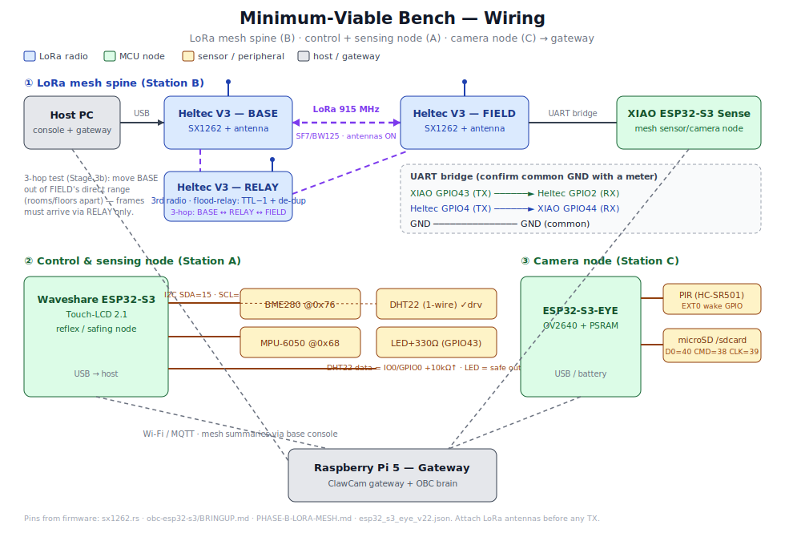

# 🔧 Bench Binder — OBC / ClawCam Hardware

**The single printable reference for the bench.** Assembled from the three source docs
(`BENCH-TEST-HARDWARE.md`, `BENCH-MVB-WIRING.svg`, `BENCH-PINOUT-CARDS.md`) in build order:
what to buy → how it wires → per-board pinouts → the full-rig BOM.

> **To print:** open in VS Code with *Markdown PDF*, or `pandoc BENCH-BINDER.md -o bench-binder.pdf`.
> Each `# Part` starts a major section; `---` rules mark natural page breaks.

**Status legend:** `DRIVER` = code exists · `REGISTRY` = catalogued, no host driver ·
`PLANNED` = docs only. **Costs are approximate USD — verify with a supplier.** Match your
LoRa band: **915 MHz (US) / 868 MHz (EU)**.

**Contents**
1. Part 1 — Minimum-Viable Bench (buy this first)
2. Part 2 — MVB wiring diagram
3. Part 3 — Per-board pinout cards
4. Part 4 — Full-rig BOM (all stations)
5. Part 5 — Appendices (quick-ref + totals)

---

# Part 1 — Minimum-Viable Bench (start here — one order)

The smallest kit that exercises the **validated + in-progress** tracks: MCU control &
sensing (A), the LoRa mesh spine (B), and the ClawCam camera node (C), reporting to a
gateway host. Add Stations D–G later (GNSS / satellite / drone / edge-AI).

**Assumes you already have:** a host workstation with the toolchains, a multimeter, and
USB-C data cables.

| # | Item | Qty | ~Cost | Unlocks |
|---|---|---|---|---|
| 1 | Heltec WiFi LoRa 32 V3 (SX1262) | 3 | $66 | Mesh spine, relay/multi-hop (B) |
| 2 | 915/868 MHz LoRa antenna (match region) | 3 | $12 | **Required before any TX** |
| 3 | Seeed XIAO ESP32-S3 Sense | 2 | $28 | Mesh sensor/camera node + UART bridge |
| 4 | Waveshare ESP32-S3-Touch-LCD-2.1 | 1 | $28 | Primary control/reflex/safing node (A) |
| 5 | Espressif ESP32-S3-EYE v2.2 | 2 | $100 | ClawCam camera-trap node (C) |
| 6 | PIR sensor (HC-SR501/AM312) | 3 | $6 | Camera wake trigger (S3-EYE has none) |
| 7 | DHT22 (temp/humidity — has a driver) | 2 | $8 | First sensor bring-up (A) |
| 8 | BME280 + MPU-6050 (Qwiic) | 1 ea | $11 | Next sensor + IMU drivers |
| 9 | LED + resistor assortment | 1 | $6 | Track-0 GPIO output smoke test |
| 10 | microSD 16 GB Class 10 + reader | 4 | $30 | Capture storage |
| 11 | LiPo 3.7V 1000 mAh + charger | 3 | $34 | Battery / deep-sleep paths |
| 12 | Breadboard + jumper wire kit | 1 | $12 | Wiring the bridge + sensors |
| 13 | USB–UART adapter (CP2102N) | 1 | $8 | Base-station console feed |
| 14 | Raspberry Pi 5 (8 GB) kit + SSD | 1 | $120 | Gateway host (ClawCam + brain) |

**Rough total: ~$470** (drop the Pi 5 if you run the gateway on your workstation → ~$350).

**Bring-up order once it arrives:**
1. Flash one **Heltec V3**, confirm boot/OLED, then a **two-Heltec ping** (antennas on).
   The **third Heltec is the relay** — it joins at walkthrough Stage 3b for the true
   3-hop test (that's why the kit has 3, not 2).
2. Bring up the **Waveshare ESP32-S3** control path — LED smoke test, then **DHT22** read.
3. Add the **XIAO ↔ Heltec UART bridge** (Part 3) → a sensor summary over the mesh.
4. Flash an **ESP32-S3-EYE**, wire a **PIR**, verify capture → microSD → wake.
5. Stand up the **Pi 5 gateway**, point a node at it, confirm end-to-end ingest.

---

# Part 2 — MVB wiring diagram

**If the image doesn't render** (some Markdown-PDF tools skip external SVG), open
`BENCH-MVB-WIRING.svg` directly. The three subsystems it shows:

- **① LoRa mesh spine:** Host PC ─USB→ Heltec V3 (base) ⇢ *LoRa 915 MHz* ⇢ Heltec V3 (field)
  ─UART→ XIAO ESP32-S3, plus the **Heltec V3 relay** (3rd radio, flood-relay TTL−1 + de-dup)
  for the Stage 3b 3-hop test: base ⇢ relay ⇢ field once the direct path is out of range.
- **② Control & sensing node:** Waveshare ESP32-S3 + I2C (BME280/MPU-6050) + DHT22 + LED.
- **③ Camera node:** ESP32-S3-EYE + PIR (EXT0 wake) + microSD.
- All report to the **Pi 5 gateway** (Wi-Fi/MQTT; mesh summaries via the base console).

**UART bridge (field Heltec ↔ XIAO):** XIAO GPIO43 (TX) → Heltec GPIO2 (RX) · Heltec GPIO4
(TX) → XIAO GPIO44 (RX) · **common GND** (meter it first).

---

# Part 3 — Per-board pinout cards

Pins the **firmware actually drives** (for probing/soldering this bench). `[fw]` = assigned
in our firmware · `[board]` = vendor reference. **Verify against the vendor silkscreen
before soldering.**

## Card 1 — Heltec WiFi LoRa 32 V3 (ESP32-S3 + SX1262)  ·  base + relay + field (all 3)

*Same card for all three radios. The relay is radio-only — antenna + USB power, no external
wiring; the UART bridge below applies only to the field unit (`heltec-gw`).*

**SX1262 radio (SPI)** `[fw] sx1262.rs`: NSS **8** · SCK **9** · MOSI **10** · MISO **11** ·
RST **12** · BUSY **13** · DIO1 **14** · TCXO on **DIO3** (1.8 V) · RF switch on **DIO2**.

**UART bridge** `[fw] PHASE-B-LORA-MESH.md`: RX **GPIO2** (← XIAO GPIO43) · TX **GPIO4**
(→ XIAO GPIO44) · GND common.

**Board** `[board]`: OLED I2C SDA/SCL/RST **17/18/21** · Vext power ctrl **36** (active-LOW) ·
LED **35** · VBAT divider **1** (rev-dependent) · BOOT=GPIO0 + RST.

⚠ **Antenna on before TX.** SF7 / BW125 / CR4-5 / syncword 0x1424 / +22 dBm.

## Card 2 — Seeed XIAO ESP32-S3 Sense  ·  mesh sensor/camera node

**UART bridge** `[fw]`: **D6/GPIO43** TX → Heltec GPIO2 · **D7/GPIO44** RX ← Heltec GPIO4 · GND.

**Board** `[board]` (14-pin): D0=1 · D1=2 · D2=3 · D3=4 · D4=5 (SDA) · D5=6 (SCL) · D6=43 ·
D7=44 · D8=7 (SCK) · D9=8 (MISO) · D10=9 (MOSI) · 3V3/5V/GND. OV2640 + PDM mic + microSD are
on the **Sense expansion board** (not on the header). Free for probing: D0–D5, D8–D10.

## Card 3 — Waveshare ESP32-S3-Touch-LCD-2.1  ·  control / sensing node

`[fw] obc-esp32-s3/BRINGUP.md`:
- UART0: TX **43** · RX **44**
- I2C sensors: SDA **4** · SCL **5**  → BME280 @0x76, MPU-6050 @0x68 (shared bus)
- I2S mic: SCK **0** · WS **1** · SD **2**
- OV2640: XCLK **15** · SIOD **4** · SIOC **5** · D0–D7 **39,40,41,42,16,17,18,19** · VSYNC
  **21** · HREF **38** · PCLK **13**
- **Safe output pins (Track-0 GPIO writes): 3, 14, 26, 33, 46** — put the LED here (e.g. 14).
- DHT22: one free 1-wire GPIO (not a camera/I2C/I2S pin).

⚠ Camera SIOD/SIOC **share** I2C 4/5 — plan camera vs sensor-bus use. `[board]`: GT911 touch,
IP5306 power mgmt, I2S audio.

## Card 4 — Espressif ESP32-S3-EYE v2.2  ·  ClawCam camera-trap node  *(pinmap unverified)*

`[fw] esp32_s3_eye_v22.json`:
- OV2640: XCLK **15** (16 MHz) · SIOD **4** · SIOC **5** · D0–D7 **11,9,8,10,12,18,17,16** ·
  VSYNC **6** · HREF **7** · PCLK **13**
- microSD (SDMMC 1-bit): D0 **40** · CMD **38** · CLK **39** → `/sdcard`
- **PIR wake (EXT0): unassigned** (`pir_gpio=-1`) — **wire an HC-SR501/AM312 to a free
  RTC-capable GPIO**
- Battery: pads only (`battery_adc_channel=-1`), low-batt **3.55 V**

⚠ No built-in PIR; confirm the pinmap on first flash (status `unverified`).

**Probing tips:** common ground first · keep LoRa antennas on · S3 boot via BOOT(GPIO0)+RST ·
safe outputs only for the Waveshare GPIO test · cross-check the vendor pinout for header pins.

---

# Part 4 — Full-rig BOM (all stations)

Core rig + one station per test area. Build **Core + A + B + C** first (that's Part 1); D–G
map to the not-yet-built phases.

## §0 Core bench rig (every station)
| Item | Example | Qty | ~Cost | Status |
|---|---|---|---|---|
| USB-C data cables | — | 4–6 | $3 ea | — |
| Powered USB hub (7-port) | — | 1 | $25 | — |
| USB–UART adapter | CP2102N / FT231X | 2 | $8 ea | REGISTRY |
| Multimeter | any | 1 | $25 | BENCH |
| Logic analyzer (8-ch) | Saleae-clone 24 MHz | 1 | $12 | BENCH |
| Breadboard + jumper kit | 830-pt + 120 wires | 2 | $12 | — |
| LiPo 3.7V + charger | JST-PH | 3 | $8 ea | — |
| microSD 16 GB + reader | Class 10 | 4 | $6 ea | DRIVER |
| Qwiic/STEMMA-QT + Grove cables | — | 1 | $12 | REGISTRY |

## §A MCU control & sensing node
| Item | Example | Qty | ~Cost | Status |
|---|---|---|---|---|
| Waveshare ESP32-S3-Touch-LCD-2.1 | Waveshare | 1 | $28 | DRIVER |
| Seeed XIAO ESP32-S3 Sense | Seeed 102010496 | 2 | $14 ea | DRIVER |
| DHT22 / AM2302 | AOSONG | 2 | $4 ea | **DRIVER** |
| BME280 (Qwiic) | Adafruit/SparkFun | 2 | $6 ea | DRIVER (host read) |
| MPU-6050 IMU (Qwiic) | — | 1 | $5 | DRIVER (host read) |
| LED + 330Ω resistors | assortment | 1 | $6 | BENCH |
| SG90 servo · TB6612FNG + DC motor · PCA9685 | — | 1 ea | $17 | REGISTRY (Movement) |
| INMP441 mic + MAX98357A amp + speaker | — | 1 | $12 | REGISTRY (Audio) |

## §B LoRa mesh (Phase B + G2)
| Item | Example | Qty | ~Cost | Status |
|---|---|---|---|---|
| Heltec WiFi LoRa 32 V3 | HTIT-WB32LA | 3 | $22 ea | **DRIVER** (validated) |
| 915/868 MHz antenna | u.FL/SMA | 3 | $4 ea | **MANDATORY before TX** |
| LILYGO T-Beam (GPS+LoRa) | LILYGO | 1 | $35 | REGISTRY + fw |
| LILYGO T-Deck Plus (SX1262+GNSS+kbd) | LILYGO | 1 | $75 | DRIVER |
| RAK4631 WisBlock (nRF52840+SX1262) | RAKwireless | 1 | $20 | REGISTRY + fw |

## §C ClawCam camera-trap node (G2)
| Item | Example | Qty | ~Cost | Status |
|---|---|---|---|---|
| ESP32-S3-EYE v2.2 (OV2640, PSRAM) | Espressif | 2 | $50 ea | DRIVER-fw (**unverified**) |
| PIR motion sensor | HC-SR501 / AM312 | 3 | $2 ea | DRIVER-fw |
| LiPo 3.7V + JST | 1000 mAh | 2 | $8 ea | DRIVER |
| ESP32-S3-CAM (OV2640) spare | Freenove | 1 | $12 | REGISTRY |
| BME280/BMP280 (planned node env) | — | 1 | $5 | PLANNED |

## §D Positioning / GNSS (G3)
| Item | Example | Qty | ~Cost | Status |
|---|---|---|---|---|
| u-blox NEO-M8N module + antenna | GY-NEO8M | 2 | $12 ea | PLANNED (no driver) |
| Active GPS antenna (SMA/u.FL) | 28 dB | 2 | $6 ea | — |

## §E Cellular & satellite backhaul (G6)
| Item | Example | Qty | ~Cost | Status |
|---|---|---|---|---|
| SIM7600 LTE + GNSS module | SIMCom | 1 | $35 | REGISTRY (no driver) |
| LTE antenna + data SIM | — | 1 | $15 + plan | — |
| Iridium SBD modem | RockBLOCK 9603 | 1 | $250 | PLANNED (no code) |
| Swarm satellite modem (alt) | Swarm M138 | 1 | $120 + plan | PLANNED |

## §F Drone / aerial (G8)
| Item | Example | Qty | ~Cost | Status |
|---|---|---|---|---|
| Flight controller (PX4/ArduPilot) | Holybro Pixhawk 6C | 1 | $200 | PLANNED (adapter done) |
| GPS/compass for FC | M8N/M9N | 1 | $25 | PLANNED |
| SiK telemetry radio pair | Holybro 915 MHz | 1 | $35 | PLANNED |
| PX4 SITL (software-first) | — | — | $0 | recommended before hardware |

## §G Edge-AI acceleration (optional — pick one)
| Item | Example | Qty | ~Cost | Status |
|---|---|---|---|---|
| Google Coral USB Accelerator | Coral | 1 | $60 | REGISTRY |
| RPi AI HAT+ (Hailo-8L 13 TOPS) | RPi | 1 | $70 | REGISTRY |
| RPi AI Camera (Sony IMX500) | RPi | 1 | $70 | REGISTRY |
| Luxonis OAK-D Lite | Luxonis | 1 | $90 | REGISTRY |
| NVIDIA Jetson Orin Nano | NVIDIA | 1 | $250 | REGISTRY |

## §H Gateway & brain host
| Item | Example | Qty | ~Cost | Status |
|---|---|---|---|---|
| Raspberry Pi 5 8 GB + PSU + case + SSD | RPi | 1 | $120 | DRIVER (`rpi.rs`) |
| NVIDIA Jetson Orin Nano (alt) | NVIDIA | 1 | $250 | REGISTRY |

---

# Part 5 — Appendices

## A. Shopping totals
- **Minimum-viable bench** (Core + A + B + C, Part 1): **~$470** (~$350 without the Pi 5).
- **Full rig** (adds D GNSS ~$40 · E cellular $50 / satellite $120–250 · F drone ~$260 ·
  G one accelerator $60–90): **~$950–1,150** — satellite + drone dominate and are later-phase.

## B. Wiring quick-reference (from firmware)
- **Heltec V3 ↔ SX1262:** NSS 8 · SCK 9 · MOSI 10 · MISO 11 · RST 12 · BUSY 13 · DIO1 14 ·
  TCXO DIO3 (1.8 V) · RF switch DIO2.
- **Phase-B UART bridge:** XIAO **GPIO43 → Heltec GPIO2**; **Heltec GPIO4 → XIAO GPIO44**;
  shared GND (meter it).
- **Waveshare ESP32-S3:** UART0 43/44 · I2C 4/5 · I2S mic 0/1/2 · OV2640 XCLK15/SIOD4/SIOC5/
  D0–D7 39–42,16–19/VSYNC21/HREF38/PCLK13 · safe outputs 3,14,26,33,46.
- **ESP32-S3-EYE:** camera XCLK15/SIOD4/SIOC5/D0–D7 11,9,8,10,12,18,17,16/VSYNC6/HREF7/
  PCLK13 · SD D0=40/CMD=38/CLK=39 → `/sdcard` · **PIR unassigned** · low-batt 3.55 V.
- **T-Deck** (if used): power-gate **GPIO10 HIGH first** · shared SPI SCK40/MISO38/MOSI41 →
  ST7789 (CS12,DC11,BL42), SX1262 (CS9,DIO1 45,RST17,BUSY13), microSD (CS39) · kbd I2C 18/8.

---

*Source docs: `docs/BENCH-TEST-HARDWARE.md`, `docs/BENCH-MVB-WIRING.svg`,
`docs/BENCH-PINOUT-CARDS.md`. Firmware pin sources: `firmware/heltec-lora-linktest/src/sx1262.rs`,
`firmware/obc-esp32-s3/{BRINGUP.md,CAMERA.md}`, `docs/PHASE-B-LORA-MESH.md`,
`ClawCam/firmware/clawcam_node_espidf/boards/esp32_s3_eye_v22.json`. Verify board-reference
pins against current vendor silkscreen/datasheets.*
